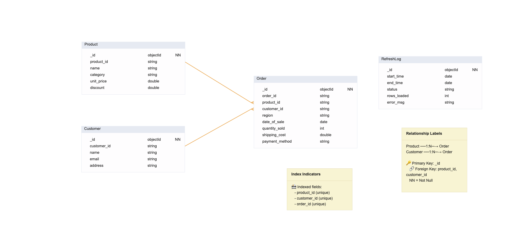

## Database Schema

Our system uses a normalized database design with the following collections:

### Collections Overview

**Product** (Master data for products)

- Stores product information including pricing and discount
- Connected to orders via `product_id`

**Customer** (Master data for customers)

- Stores customer contact information
- Connected to orders via `customer_id`

**Order** (Transaction data)

- Each order references one product and one customer
- Contains transaction details (quantity, shipping, payment method)

**RefreshLog** (System logs)

- Tracks data refresh operations
- Independent collection for monitoring

### Relationships

- **Product → Order**: One-to-Many (1:N)
- **Customer → Order**: One-to-Many (1:N)
- One product can appear in multiple orders
- One customer can place multiple orders
